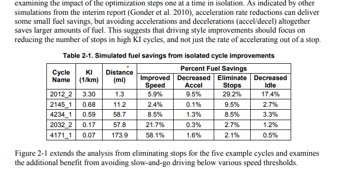

# 说明
本文件夹为使用camelot提取pdf中的table数据并保存为csv文件

* camelot_pdf_table_parse.py 为使用camlot提取pdf中表格数据并保存为csv的代码
* foo.pdf 为样本pdf，来源自[camelot的测试pdf](https://camelot-py.readthedocs.io/en/master/_static/pdf/foo.pdf)
* table.csv 为最后的保存的csv文件
* img 为readme的图片

# 效果
pdf原始表格


提取后的dataframe效果
```
  report_date             0            1                2                     3                  4                  5                 6
0  2023-02-28  Cycle \nName  KI \n(1/km)  Distance \n(mi)  Percent Fuel Savings
1  2023-02-28                                                  Improved \nSpeed  Decreased \nAccel  Eliminate \nStops  Decreased \nIdle
2  2023-02-28        2012_2         3.30              1.3                  5.9%               9.5%              29.2%             17.4%
3  2023-02-28        2145_1         0.68             11.2                  2.4%               0.1%               9.5%              2.7%
4  2023-02-28        4234_1         0.59             58.7                  8.5%               1.3%               8.5%              3.3%
5  2023-02-28        2032_2         0.17             57.8                 21.7%               0.3%               2.7%              1.2%
6  2023-02-28        4171_1         0.07            173.9                 58.1%               1.6%               2.1%              0.5%
```

最终的csv文件
```
report_date,0,1,2,3,4,5,6
2023-02-28,"Cycle 
Name","KI 
(1/km)","Distance 
(mi)",Percent Fuel Savings,,,
2023-02-28,,,,"Improved 
Speed","Decreased 
Accel","Eliminate 
Stops","Decreased 
Idle"
2023-02-28,2012_2,3.30,1.3,5.9%,9.5%,29.2%,17.4%
2023-02-28,2145_1,0.68,11.2,2.4%,0.1%,9.5%,2.7%
2023-02-28,4234_1,0.59,58.7,8.5%,1.3%,8.5%,3.3%
2023-02-28,2032_2,0.17,57.8,21.7%,0.3%,2.7%,1.2%
2023-02-28,4171_1,0.07,173.9,58.1%,1.6%,2.1%,0.5%

```